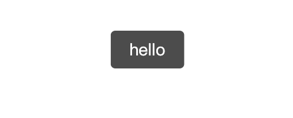

# little-toast

## Screenshot



## Development

```sh
npm install
npm run build
```

open file `example.html` in browser.

## Usage

### ESM

```js
import { showToast } from 'little-toast';
import 'little-toast/dist/styles.css';

showToast('hello');
```

### UMD

1. 引入

```html
<link rel="stylesheet" href="./dist/styles.css" />
<script src="./dist/toast.umd.js"></script>
```

2. 使用

```js
LittleToast.showToast('hello');
```
